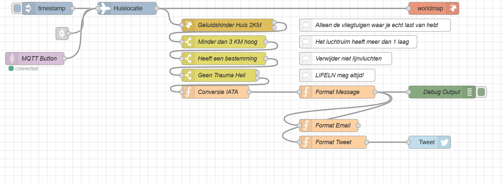

# TwitterMelder
>Hoe meld SchipholHerrie semi-geautomatiseerd naar Twitter
>Want een beetje mag wel, maar het is niet de bedoeling dat Schiphol je slaapritme bepaald.

## Benodigdheden
*NB: Dit is mijn setup, wil je jouw setup delen, neem contact op via Twitter*

+ Docker met HomeAssistant + MQTT + NodeRed
+ NodeRed Plugins:
 + node-red-contrib-flightradar24
 + node-red-contrib-web-worldmap (Het kan zonder, maar is fijn voor debuggen)
 + node-red-node-geofence
 + node-red-node-twitter
+ Een knop (Zigbee?)

### NodeRed Flow
[Download deze flow](nodered-flow.json)

